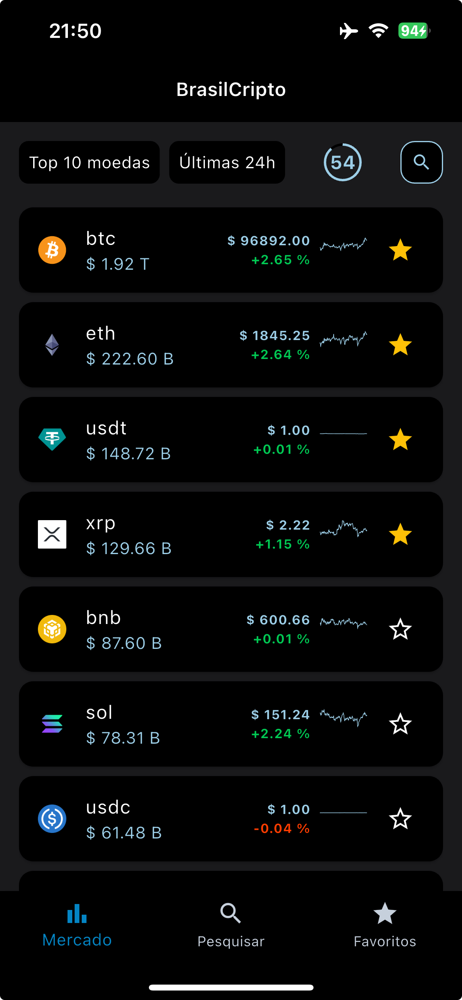
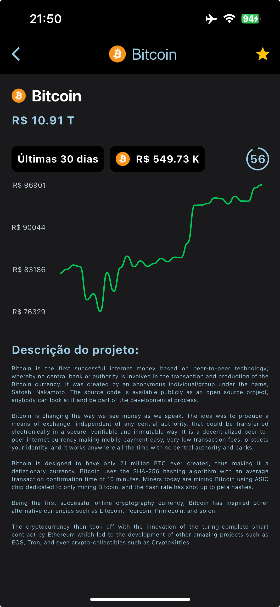
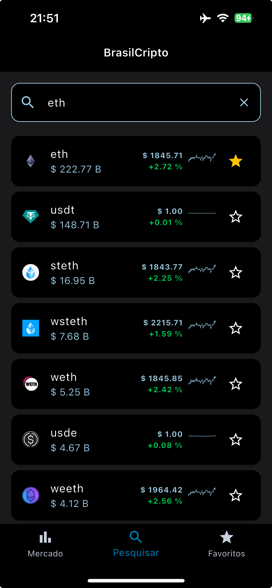
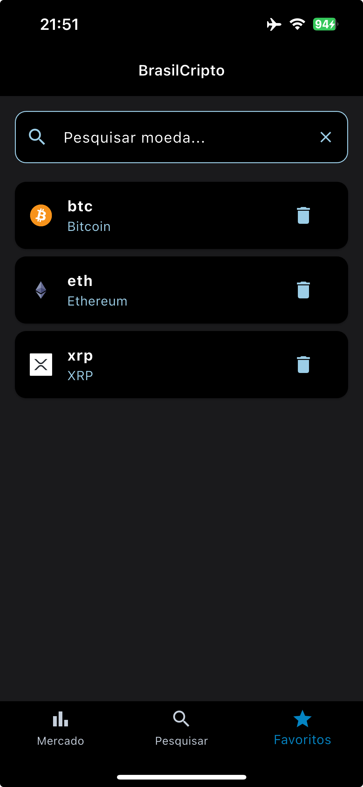
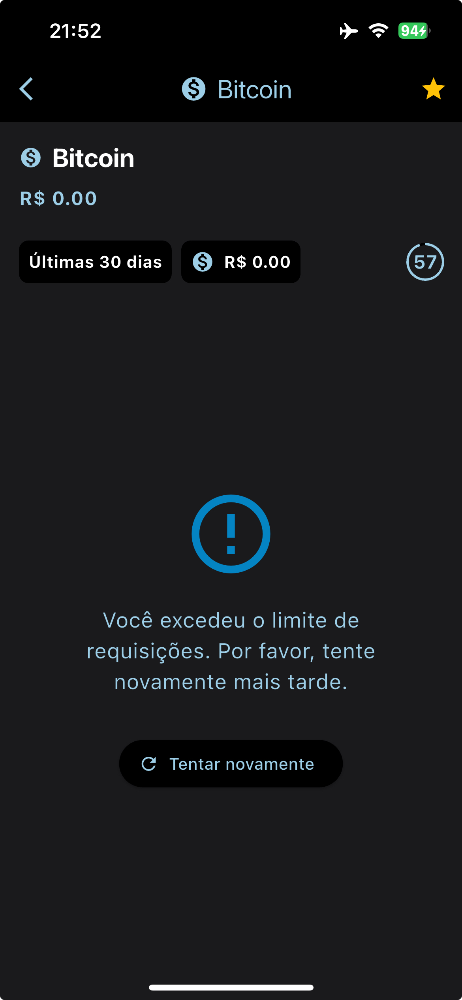
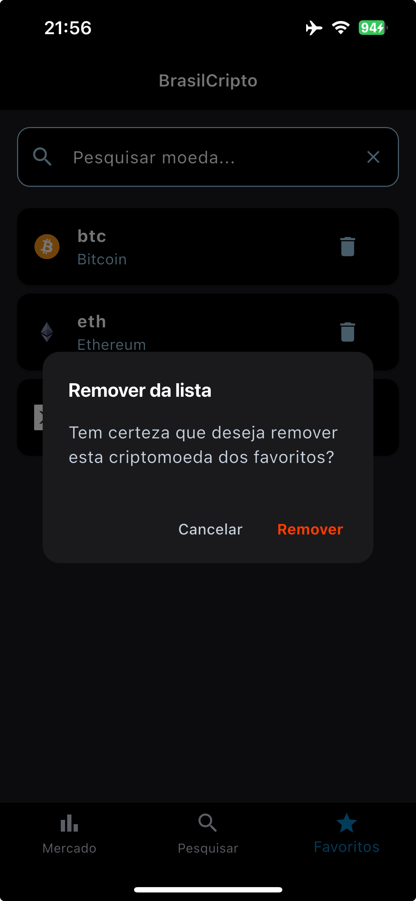

## 🧠 Decisões Técnicas

### 🔁 Uso de Debounce
Durante o desenvolvimento da funcionalidade de busca de criptomoedas no aplicativo, foi necessário encontrar um equilíbrio entre a experiência do usuário e a eficiência no uso da rede, respeitando os limites da API.
A estratégia adotada foi a utilização de um debounce, controlando as chamadas à API conforme a digitação do usuário.
Essa abordagem evita requisições desnecessárias e otimiza o desempenho das buscas, garantindo mais fluidez.

### 🔄 Atualização automática de dados
Foi implementado um componente chamado CircularCountdownTimer para realizar a atualização automática dos dados em intervalos regulares.
Isso elimina a necessidade de ações manuais por parte do usuário (Tentar atualizar várias vezes seguidas e extrapolar o limite da API) e proporciona um indicador visual claro sobre o tempo restante para a próxima atualização — especialmente útil devido a limitações de taxa da API.

### ⚠️ Tratamento de erros padronizado
Foi criada uma camada de mapeamento de erros (mapErrorToMessage) para centralizar o tratamento de exceções.
Com isso, evitam-se repetições de lógica e proporciona-se uma experiência de usuário mais amigável, substituindo mensagens técnicas ou genéricas por comunicações mais claras e compreensíveis.

### 🧱 Arquitetura MVVM com GetX
A aplicação foi estruturada com o padrão MVVM (Model-View-ViewModel) utilizando o framework GetX, garantindo:

Separação clara de responsabilidades: os Controllers atuam como ViewModels, isolando regras de negócio da UI.

Gerenciamento de estado reativo eficiente com Rx, reduzindo código boilerplate.

Navegação simplificada e injeção de dependência automática, mantendo o projeto limpo.

### 🖼️ Cache de Imagens para Uso Offline
Uso de estratégia de cache na lista de favoritos para exibição de imagem offline.


# 🚀 Como instalar e executar o projeto Flutter

## 📦 Requisitos

Antes de começar, certifique-se de que os seguintes itens estejam instalados:

- [Flutter SDK](https://docs.flutter.dev/get-started/install)
- [Dart SDK](https://dart.dev/get-dart)
- [Android Studio](https://developer.android.com/studio) ou [Visual Studio Code](https://code.visualstudio.com/) com o plugin Flutter
- Emulador Android ou dispositivo físico conectado via USB
- [Git](https://git-scm.com/)

---

## 📥 Clonando o projeto

```bash
git clone https://github.com/seu-usuario/seu-repositorio.git
cd seu-repositorio
```

## 📦 Instalando as dependências
```bash
flutter pub get
```


## 🏗️ Rodando o app
Conecte um dispositivo Android (ou inicie um emulador).

Execute o comando: 
```bash
flutter run
```

## 📱 Resultado

<p align="center">
  
  
  
  
  
  
</p>
